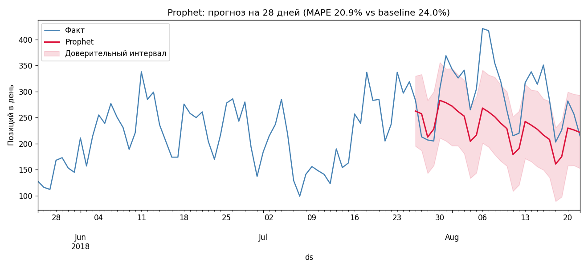
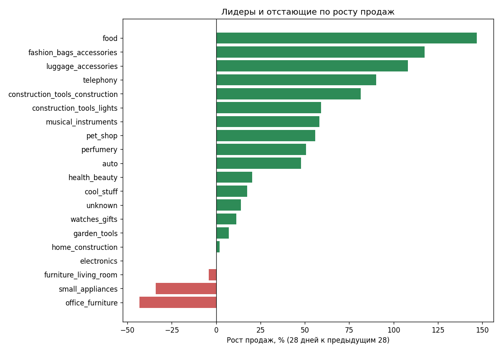

# Marketplace AI

> Sales forecasting, trend analytics and bought-together recommendations for an online marketplace.
> Built on the real **Olist** dataset (~100k Brazilian e-commerce orders, 2016–2018).
> Stack: Python · pandas · Prophet · Streamlit. Bilingual dashboard (🇷🇺 / 🇬🇧). 28 tests.

AI-система аналитики для маркетплейса: **прогноз продаж**, **анализ трендов** и **рекомендации «покупают вместе»**.
Помогает продавцу решать: сколько товара закупить, в какие категории заходить и что предлагать в довесок.

Данные: [Olist Brazilian E-Commerce](https://www.kaggle.com/datasets/olistbr/brazilian-ecommerce) — реальный бразильский маркетплейс, ~100k заказов за 2016–2018.

## Что внутри

| Модуль | Вопрос продавца | Метод |
|--------|-----------------|-------|
| 📈 Прогноз | Сколько будут покупать в следующем месяце? | Prophet (тренд + сезонность + праздники) |
| 🔥 Тренды | Какие категории растут, какие падают? | Сравнение 28 дней с предыдущими 28 |
| 🛒 Покупают вместе | Что предложить в дополнение? | Частые пары: confidence + lift |

### Результат прогноза

| Модель | MAPE | MAE |
|--------|------|-----|
| Наивный baseline | 24.0% | 80 позиций/день |
| **Prophet** | **20.9%** | **65 позиций/день** |

Точность проверена честно: последний месяц данных скрыт от модели, прогноз сравнён с фактом.




## Структура

- `data/` — CSV-файлы датасета (не в git, скачиваются скриптом)
- `notebooks/` — Jupyter-ноутбуки для анализа (EDA, эксперименты с моделями)
- `src/` — Python-скрипты (подготовка данных, модели, дашборд)

## Установка

Требуется **Python 3.14**. Зависимости закреплены в `requirements.txt` (runtime) и
`requirements-dev.txt` (тесты + линтер).

**Windows (PowerShell):**

```powershell
python -m venv .venv
.venv\Scripts\Activate.ps1
pip install -r requirements-dev.txt
python -c "import kagglehub, shutil, pathlib; p = kagglehub.dataset_download('olistbr/brazilian-ecommerce'); [shutil.copy(f, 'data') for f in pathlib.Path(p).glob('*.csv')]"
```

**Linux / macOS:**

```bash
python3 -m venv .venv
source .venv/bin/activate
make install-dev   # или: pip install -r requirements-dev.txt
python -c "import kagglehub, shutil, pathlib; p = kagglehub.dataset_download('olistbr/brazilian-ecommerce'); [shutil.copy(f, 'data') for f in pathlib.Path(p).glob('*.csv')]"
```

> Только для работы приложения (без тестов) достаточно `pip install -r requirements.txt`.

## Запуск

Пересчёт всех артефактов по порядку, затем дашборд. На Linux/macOS одной командой:
`make run-pipeline` и `make run-dashboard`.

**Windows (PowerShell):**

```powershell
python src\prepare_data.py      # витрина продаж
python src\forecast_baseline.py # baseline-метрики
python src\forecast_prophet.py  # модель + прогноз на 28 дней
python src\trends.py            # тренды категорий
python src\recommend.py         # «покупают вместе»
streamlit run src\dashboard.py  # дашборд: http://localhost:8501
```

Тесты (`make test` на Linux/macOS):

```powershell
python -m pytest tests
```

## Этапы проекта

- [x] Этап 0 — окружение и данные
- [x] Этап 1 — очистка данных + EDA
- [x] Этап 2 — baseline-прогноз (naive_mean: MAPE 24.0%, seasonal_naive: 26.7%)
- [x] Этап 3 — модель прогноза (Prophet: MAPE 20.9% — лучше baseline на 3.1 п.п.)
- [x] Этап 4 — аналитика трендов (рост категорий: 28 дней к предыдущим 28)
- [x] Этап 5 — рекомендации «покупают вместе» (частые пары: confidence + lift)
- [x] Этап 6 — Streamlit-дашборд (прогноз / тренды / рекомендации)
- [x] Локализация дашборда RU/EN (переключатель вверху страницы, графики на обоих языках)

## Лицензия

Код — [MIT](LICENSE). Датасет Olist распространяется отдельно на Kaggle под лицензией
CC BY-NC-SA 4.0 и **в репозиторий не входит** — скачивается скриптом установки.
